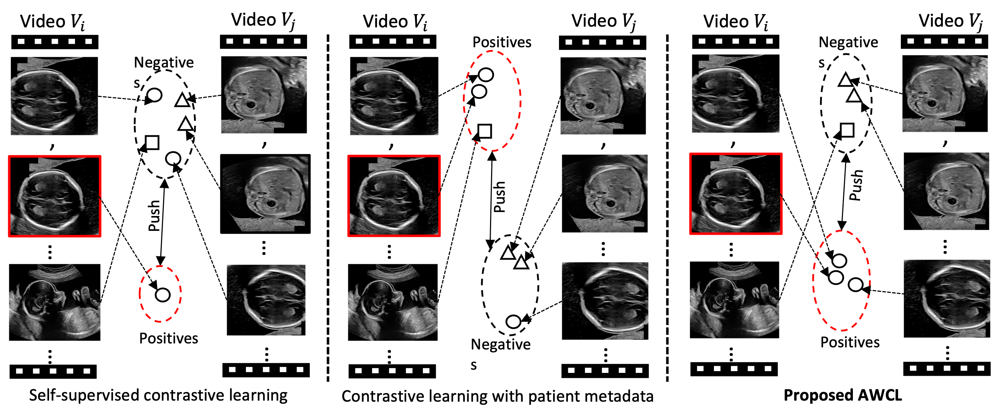
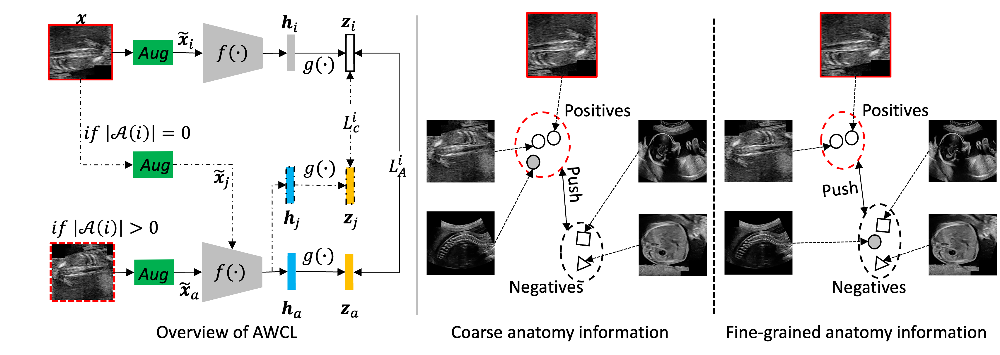

# Anatomy-Aware Contrastive Representation Learning for Fetal Ultrasound


This repository provides the code for the paper:

[Zeyu Fu](https://scholar.google.co.uk/citations?user=jVMQbI8AAAAJ&hl=en), [Jianbo Jiao](https://jianbojiao.com/), [Robail Yasrab](https://scholar.google.com/citations?user=Dtpy-6cAAAAJ&hl=en), [Lior Drukker](https://scholar.google.com/citations?user=WsShxmIAAAAJ&hl=en), [Aris T. Papageorghiou](https://scholar.google.com/citations?user=43VTp-kAAAAJ&hl=en) and [J. Alison Noble](https://eng.ox.ac.uk/people/alison-noble/). [*Anatomy-Aware Contrastive Representation Learning for Fetal Ultrasound*](https://arxiv.org/abs/2208.10642). In: ECCV-[MCV](https://mcv-workshop.github.io/) (2022).

### :trophy: Best Paper Award!

<!-- * [https://arxiv.org/abs/2208.10642](https://arxiv.org/abs/2208.10642) -->

---
## Illustration of the proposed AWCL and other learning approaches:

<!--  -->



---
## Main framework of AWCL:

<!--  -->



---
## Dependencies

To install the dependencies into a new conda environment, simpy run:
```bash
conda env create -f environment.yml
source activate awcl
```

Alternatively, you can install them manually:
```bash
conda create --name awcl
source activate awcl
conda install pytorch=1.12 torchvision cudatoolkit=11.6 -c pytorch
conda install opencv=3.4 -c conda-forge
conda install scipy, scikit-learn, scikit-image
pip install tensorboardX==2.1
```

---

## Usage

### Data

As the used clinical dataset PULSE is not allowed to release to the public, it is not included here. But please feel free to use your own data, by modifying the data loader defined in [data.py](data.py)

Specify the paths of the dataset with the environment variable
`LOCAL_DATA_DIR`.


### Training

To train the model, simpy run: 
```bash
python main.py
```

By default, this function train the model on the PULSE data with the proposed anatomy-aware contrastive learning approach.
The training data and models are saved in the `results` folder.

---
## Citation

If you find AWCL useful, please cite the following BibTeX entry:
```
@inproceedings{awcl,
  title={Anatomy-Aware Contrastive Representation Learning for Fetal Ultrasound},
  author={Zeyu, Fu and Jianbo, Jiao and Robail, Yasrab and Lior, Drukker and Aris T. Papageorghiou and Alison, Noble},
  booktitle="European Conference on Computer Vision Workshop",
  year={2022},
}
```

## Achnowledgement
Part of our codes are adapted from and based on [SupContrast](https://github.com/HobbitLong/SupContrast), we thank the authors for their contributions.